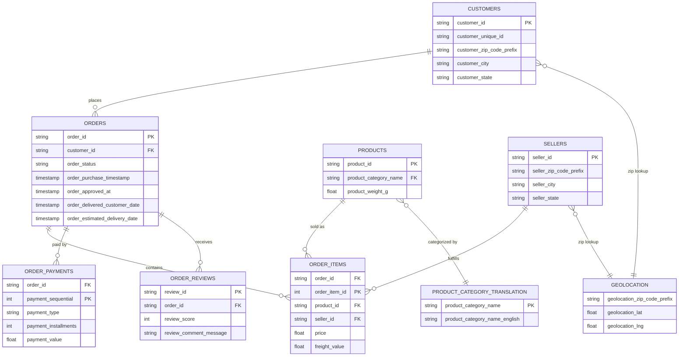
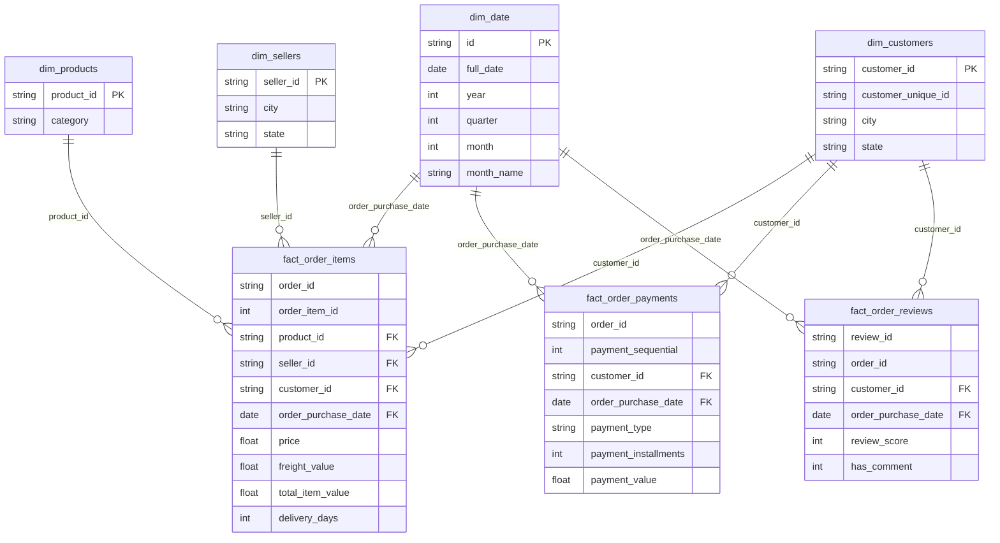

# Mini Project: Data Warehouse & Data Model Design — Olist Brazilian E-Commerce

การออกแบบคลังข้อมูล (Data Warehouse) และโมเดลข้อมูลหลายมิติ (Multidimensional Data Model)
เพื่อแปลงระบบ OLTP ของ [Olist Brazilian E-Commerce Public Dataset](https://www.kaggle.com/datasets/olistbr/brazilian-ecommerce)
ให้กลายเป็นระบบ OLAP สำหรับตอบคำถามทางธุรกิจ

---

## 1. Operational Database

Olist เป็นแพลตฟอร์มมาร์เก็ตเพลสของบราซิลที่เชื่อมร้านค้า (sellers) เข้ากับลูกค้าทั่วประเทศ
ชุดข้อมูลนี้เป็นข้อมูลธุรกรรมจริง (anonymized) ระหว่างปี 2016–2018 ประกอบด้วย 9 ตาราง:

| ตาราง | คำอธิบาย | จำนวนแถว (โดยประมาณ) |
|---|---|---|
| `olist_customers_dataset` | ข้อมูลลูกค้าและที่อยู่ (เมือง/รัฐ/zip) | 99,442 |
| `olist_orders_dataset` | หัวออเดอร์ สถานะ และ timestamp แต่ละขั้นตอน | 99,442 |
| `olist_order_items_dataset` | รายการสินค้าในแต่ละออเดอร์ ราคา/ค่าส่ง | 112,651 |
| `olist_order_payments_dataset` | การชำระเงินของแต่ละออเดอร์ | 103,887 |
| `olist_order_reviews_dataset` | คะแนนรีวิวและข้อความจากลูกค้า | 104,720 |
| `olist_products_dataset` | แคตตาล็อกสินค้า หมวดหมู่ ขนาด/น้ำหนัก | 32,952 |
| `olist_sellers_dataset` | ข้อมูลผู้ขายและที่อยู่ | 3,096 |
| `olist_geolocation_dataset` | ตาราง lookup zip code → lat/lng/เมือง/รัฐ | 1,000,164 |
| `product_category_name_translation` | แปลชื่อหมวดหมู่สินค้าจากโปรตุเกส → อังกฤษ | 71 |

### ER Diagram (Operational / OLTP)



---

## 2. Business Questions (15 ข้อ)

1. รายได้รวมและจำนวนออเดอร์เปลี่ยนแปลงอย่างไรในแต่ละเดือน/ไตรมาส/ปี?
2. หมวดหมู่สินค้าใดสร้างรายได้สูงสุด 10 อันดับแรก?
3. รัฐ (state) ใดของลูกค้าสร้างรายได้และจำนวนออเดอร์มากที่สุด?
4. มูลค่าออเดอร์เฉลี่ย (Average Order Value) แตกต่างกันอย่างไรในแต่ละรัฐ?
5. ผู้ขาย (seller) รายใดสร้างรายได้และจำนวนออเดอร์สูงสุด 10 อันดับแรก?
6. ระยะเวลาจัดส่งเฉลี่ย (จากวันสั่งซื้อถึงวันได้รับสินค้า) เป็นเท่าไร และแตกต่างกันตามรัฐอย่างไร?
7. ระยะเวลาจัดส่งมีความสัมพันธ์กับคะแนนรีวิวหรือไม่?
8. คะแนนรีวิวเฉลี่ยของแต่ละหมวดหมู่สินค้าเป็นอย่างไร?
9. สัดส่วนวิธีการชำระเงิน (credit card, boleto, voucher, debit card) เป็นอย่างไร?
10. จำนวนงวดผ่อนชำระ (installments) เฉลี่ยต่างกันอย่างไรในแต่ละวิธีชำระเงิน?
11. หมวดหมู่สินค้าใดมีสัดส่วนค่าขนส่งต่อราคาสินค้า (freight/price ratio) สูงที่สุด?
12. มีรูปแบบตามฤดูกาล (seasonality) ของยอดขายในแต่ละเดือนหรือไม่?
13. ออเดอร์ที่จัดส่งล่าช้ากว่าประมาณการ (delivered later than estimated) มีสัดส่วนเท่าไร และกระจายตามรัฐอย่างไร?
14. ออเดอร์ที่ได้รับคะแนนรีวิวต่ำ (1-2 ดาว) มีความสัมพันธ์กับการจัดส่งล่าช้าหรือไม่?
15. ลูกค้าที่ซื้อซ้ำ (repeat customer, นับจาก `customer_unique_id`) มีสัดส่วนเท่าไรของยอดขายทั้งหมด?

---

## 3. Multidimensional Data Model Design

โครงสร้างนี้เป็น **Fact Constellation (Galaxy Schema)** — มี Fact 3 ตารางใช้ Dimension ร่วมกัน (conformed dimensions)
เพื่อรองรับคำถามทางธุรกิจทั้ง 15 ข้อข้างต้น

### Dimensions

| Dimension | Level (จากละเอียด → หยาบ) | คำอธิบาย |
|---|---|---|
| `dim_date` | Day → Month → Quarter → Year | สร้างจาก `order_purchase_timestamp`, ใช้แจกแจงตามเวลา |
| `dim_customers` | Customer → City → State | grain = 1 แถวต่อ 1 `customer_id`, เก็บ `customer_unique_id` ไว้แยกวิเคราะห์ลูกค้าซื้อซ้ำ |
| `dim_sellers` | Seller → City → State | grain = 1 แถวต่อ 1 `seller_id` |
| `dim_products` | Product → Category (English) | grain = 1 แถวต่อ 1 `product_id`, แปลชื่อหมวดหมู่เป็นอังกฤษแล้ว |

### Fact Tables

| Fact | Grain | Measures |
|---|---|---|
| `fact_order_items` | 1 แถวต่อ 1 รายการสินค้าในออเดอร์ (order_id + order_item_id) | `price`, `freight_value`, `total_item_value`, `delivery_days` |
| `fact_order_payments` | 1 แถวต่อ 1 การชำระเงิน (order_id + payment_sequential) | `payment_value`, `payment_installments` |
| `fact_order_reviews` | 1 แถวต่อ 1 รีวิว (review_id) | `review_score`, `has_comment` |

### Data Model Diagram (Star / Galaxy Schema)



---

## 4. ETL / ELT Process

ใช้แนวทาง **ELT** ผ่าน [dbt](https://www.getdbt.com/) + [DuckDB](https://duckdb.org/):

1. **Extract**: ไฟล์ CSV ทั้ง 9 ไฟล์จาก Kaggle ถูกวางไว้ที่ `olist_dw/datasets/`
2. **Load**: dbt-duckdb ประกาศแต่ละไฟล์เป็น `source` (ผ่าน `external_location` meta ใน `src_olist.yml`)
   ทำให้ DuckDB อ่านข้อมูลดิบเข้ามาได้โดยตรงโดยไม่ต้องเขียนสคริปต์โหลดแยก
3. **Transform (Staging layer)**: โมเดล `stg_*.sql` ดึงข้อมูลจาก source แบบ 1:1 พร้อมเติมคอลัมน์
   `ingestion_timestamp` เพื่อบันทึกเวลาที่โหลดข้อมูล — materialize เป็น `table`
4. **Transform (Data Warehouse layer)**: โมเดลใน `models/datawarehouse/`
   - สร้าง `dim_*` โดย deduplicate ด้วย `ROW_NUMBER()` และ enrich ข้อมูล (เช่น join `geolocation`
     เพื่อหา lat/lng เฉลี่ยของแต่ละ zip code, join `product_category_name_translation`
     เพื่อแปลชื่อหมวดหมู่)
   - สร้าง `fact_*` โดย join กับ `stg_orders` เพื่อดึง `customer_id`/วันที่ แล้วคำนวณ measure
     เช่น `total_item_value`, `delivery_days`
   - ทดสอบคุณภาพข้อมูลด้วย `dbt test` (unique/not_null บน primary key ของแต่ละตาราง)
5. **Serve**: ผลลัพธ์เก็บใน `olist_dw/dev.duckdb` เปิดดูผ่าน `app.py` (table browser)
   และวิเคราะห์ผ่าน `dashboard_app.py` (OLAP dashboard)

---

## 5. Data Warehouse Database

ไฟล์ผลลัพธ์: `olist_dw/dev.duckdb` (สร้างจากการรัน `dbt run` ภายในโฟลเดอร์ `olist_dw/`)
ประกอบด้วย 9 staging tables + 4 dimension tables + 3 fact tables รวม 16 ตาราง

---

## 6. Interactive Dashboard

`dashboard_app.py` (Streamlit + Altair) วิเคราะห์ยอดขายจาก `fact_order_items` join กับ
`dim_date`, `dim_customers`, `dim_products`, `dim_sellers` เท่านั้น ตามที่โจทย์กำหนด
รองรับการกรองตามช่วงวันที่ หมวดหมู่สินค้า รัฐลูกค้า รัฐผู้ขาย และสถานะออเดอร์
พร้อมมุมมองยอดขายตามเวลา (ปี/ไตรมาส/เดือน), ตาม product category, และตาม customer state

🔗 **Live**: https://miniproject-vvcre79hljddpvyj82zuub.streamlit.app

---

## 7. การตั้งค่าและรันโปรเจกต์

```bash
python -m venv .venv
.venv\Scripts\activate
pip install -r requirements.txt

cd olist_dw
dbt debug
dbt run
dbt test
cd ..

python query_duckdb.py
streamlit run app.py
streamlit run dashboard_app.py
```

---

## 8. Team Contribution

ดูประวัติการทำงานของสมาชิกแต่ละคนได้ที่ Commit history และ GitHub Project board ของ repository นี้

| ชื่อ | GitHub | บทบาท |
|---|---|---|
| ชวนากร เพชรเจริญรัตน์ | [@chawanakorn-phet](https://github.com/chawanakorn-phet) | Data Modeling, dbt Pipeline, Dashboard |
| กุลธิดา สมาขันธ์ | [@kunthida-samakhan](https://github.com/kunthida-samakhan) | Business Questions, Infographic |
| วรวัฒน์ พรหมคุณ | [@worawatpr-gh](https://github.com/worawatpr-gh) | Data Model Diagram, Deployment |
| เยี่ยมภพ ใบโพธิ์ | [@yiampopbaipo](https://github.com/yiampopbaipo) | Dashboard, Presentation |

---

## 9. Deliverables

- **Infographic**: [`deliverables/infographic.html`](deliverables/infographic.html) — สรุปยอดขาย, top categories/states, ผลกระทบของการจัดส่งล่าช้าต่อคะแนนรีวิว, อัตราลูกค้าซื้อซ้ำ (ตัวเลขทั้งหมดคำนวณจริงจาก `dev.duckdb`)
- **Presentation**: [`deliverables/Mini_Project_Olist_DW.pptx`](deliverables/Mini_Project_Olist_DW.pptx) — สไลด์นำเสนอครบทุกหัวข้อของโครงงาน
- **ลิงก์ Web Application**: https://miniproject-vvcre79hljddpvyj82zuub.streamlit.app
