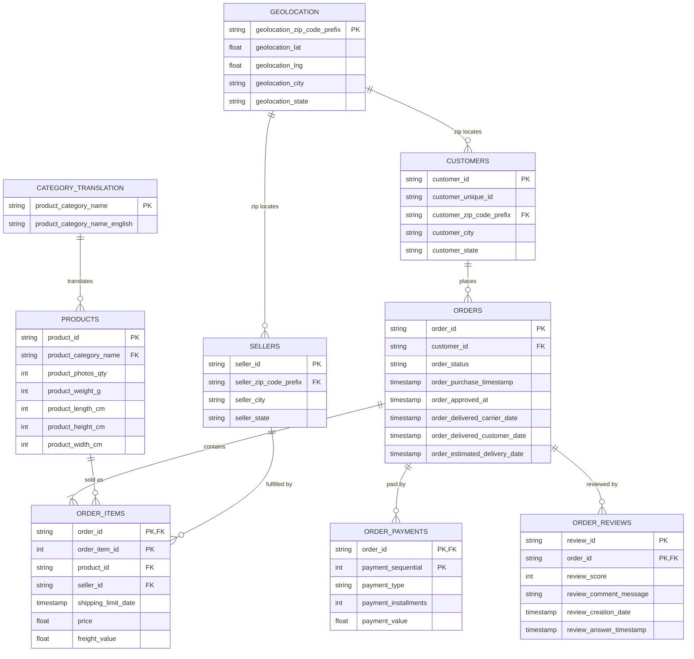
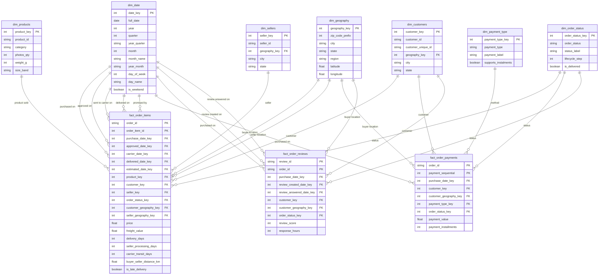

# Mini Project — Data Warehouse & Multidimensional Data Model
## Olist Brazilian E-Commerce (OLTP → OLAP)

การออกแบบและพัฒนา **Data Warehouse** พร้อม **Multidimensional Data Model** เพื่อแปลงระบบ
OLTP ของตลาดกลางออนไลน์ [Olist](https://www.kaggle.com/datasets/olistbr/brazilian-ecommerce)
ให้กลายเป็นระบบ OLAP ที่ตอบคำถามทางธุรกิจได้

โครงสร้างที่ใช้คือ **Fact Constellation (Galaxy Schema)** — Fact 3 ตารางที่ grain ต่างกัน
ใช้ Dimension ร่วมกัน (conformed) เพื่อให้ตอบคำถามที่ต้องข้าม business process ได้


---

## สารบัญ

1. [ระบบ OLTP ต้นทาง + ER Diagram](#1-ระบบ-oltp-ต้นทาง)
2. [คำถามทางธุรกิจ 15 ข้อ](#2-คำถามทางธุรกิจ-15-ข้อ)
3. [Multidimensional Data Model](#3-multidimensional-data-model)
4. [Data Model Diagram (Galaxy Schema)](#4-data-model-diagram--galaxy-schema)
5. [กระบวนการ ELT](#5-กระบวนการ-elt)
6. [Data Warehouse Database + Analytical Queries](#6-data-warehouse-database)
7. [Interactive Dashboard](#7-interactive-dashboard)
8. [Team Contribution](#8-team-contribution)
9. [โครงสร้าง Repository + วิธีรัน](#9-โครงสร้าง-repository--วิธีรัน)

---

## 1. ระบบ OLTP ต้นทาง

Olist เป็นแพลตฟอร์มมาร์เก็ตเพลสของบราซิลที่เชื่อมร้านค้ารายย่อย (sellers) กับลูกค้าทั่วประเทศ
ระบบปฏิบัติการของ Olist บันทึกธุรกรรมตลอดวงจร **สั่งซื้อ → ชำระเงิน → จัดส่ง → รีวิว**
ประกอบด้วย 9 ตาราง:

| ตาราง | ธุรกรรม/ข้อมูลที่บันทึก | จำนวนแถว |
|---|---|---:|
| `olist_customers_dataset` | ลูกค้า (1 แถว = 1 `customer_id` ต่อ 1 คำสั่งซื้อ) + ที่อยู่ | 99,441 |
| `olist_orders_dataset` | หัวคำสั่งซื้อ สถานะ และ timestamp 5 จุดของวงจร | 99,441 |
| `olist_order_items_dataset` | รายการสินค้าในคำสั่งซื้อ ราคา ค่าจัดส่ง | 112,650 |
| `olist_order_payments_dataset` | การชำระเงิน (1 คำสั่งซื้อจ่ายได้หลายครั้ง/หลายวิธี) | 103,886 |
| `olist_order_reviews_dataset` | แบบสอบถามความพอใจหลังได้รับสินค้า (คะแนน 1–5) | 99,224 |
| `olist_products_dataset` | แคตตาล็อกสินค้า หมวดหมู่ ขนาด น้ำหนัก จำนวนรูป | 32,951 |
| `olist_sellers_dataset` | ผู้ขายและที่ตั้ง | 3,095 |
| `olist_geolocation_dataset` | lookup `zip prefix → lat/lng/เมือง/รัฐ` (ซ้ำหลายแถวต่อ zip) | 1,000,163 |
| `product_category_name_translation` | แปลชื่อหมวดหมู่ โปรตุเกส → อังกฤษ | 71 |
| **รวมทั้งหมด** | | **1,550,922** |

### ตารางเวลา (Temporal columns)

ตาราง `orders` มี timestamp **5 จุด** ครบทั้งวงจรออเดอร์ — เป็นจุดแข็งของชุดข้อมูลนี้และเป็นที่มา
ของ `dim_date` ที่ทำหน้าที่ **role-playing 5 บทบาท** และ measure ด้านเวลาทั้งหมด

| คอลัมน์ | ความหมาย |
|---|---|
| `order_purchase_timestamp` | ลูกค้ากดสั่ง |
| `order_approved_at` | อนุมัติการชำระเงิน |
| `order_delivered_carrier_date` | ร้านส่งของให้บริษัทขนส่ง |
| `order_delivered_customer_date` | ลูกค้าได้รับสินค้าจริง |
| `order_estimated_delivery_date` | วันที่ระบบสัญญาว่าจะถึง |

นอกจากนี้ `order_reviews` มี `review_creation_date` และ `review_answer_timestamp`

### ER Diagram (OLTP)



**ศูนย์กลางของ OLTP คือ `orders`** — มี child 3 ตารางที่ grain ต่างกัน (`order_items` = รายบรรทัดสินค้า,
`order_payments` = รายการชำระเงิน, `order_reviews` = รายรีวิว) ทั้งสามนี้กลายเป็น 3 Fact ใน warehouse
ส่วน `geolocation` และ `category_translation` เป็น lookup ที่ถูกยุบเข้า dimension ตอน transform

---

## 2. คำถามทางธุรกิจ 15 ข้อ

ทุกข้อระบุชัดว่าตอบด้วย Fact ใด เดินผ่าน Dimension ใด และวัดด้วย Measure ใด
Query จริงของทุกข้ออยู่ที่ [`olist_dw/analyses/analytical_queries.sql`](olist_dw/analyses/analytical_queries.sql)

### กลุ่ม A ยอดขายและสินค้า
1. หมวดหมู่สินค้าใดมียอดขายรวมและจำนวนสินค้าที่ขายสูงที่สุด?
2. สินค้าประเภทใดมีราคาเฉลี่ยต่อชิ้นสูงที่สุด และมีจำนวนการขายมากน้อยเพียงใด?
3. หมวดหมู่สินค้าใดมีสัดส่วนค่าจัดส่งต่อราคาสินค้าสูงที่สุด?

### กลุ่ม B แนวโน้มยอดขายและคำสั่งซื้อ
4. ยอดขายและจำนวนคำสั่งซื้อมีแนวโน้มเปลี่ยนแปลงอย่างไรในแต่ละเดือนและปี?

### กลุ่ม C ลูกค้าและพฤติกรรมการซื้อ
5. ลูกค้าในรัฐและเมืองใดสร้างยอดขายรวมสูงที่สุด?
6. ลูกค้าที่กลับมาซื้อซ้ำคิดเป็นกี่เปอร์เซ็นต์ของลูกค้าทั้งหมด?
7. ลูกค้าที่มีจำนวนคำสั่งซื้อมากมีค่าใช้จ่ายเฉลี่ยต่อคำสั่งซื้อสูงกว่าลูกค้าทั่วไปหรือไม่?
8. ลูกค้ากลุ่มใดมีมูลค่าลูกค้าและความถี่ในการซื้อสูงที่สุดจาก RFM Analysis?

### กลุ่ม D การชำระเงิน
9. วิธีการชำระเงินใดถูกใช้งานมากที่สุด และมีมูลค่าการชำระเงินเฉลี่ยเท่าใด?

### กลุ่ม E การจัดส่งและประสิทธิภาพผู้ขาย
10. ผู้ขายในรัฐหรือเมืองใดมีระยะเวลาเตรียมสินค้าเฉลี่ยสูงที่สุด?
11. ระยะเวลาขนส่งและความล่าช้าในการจัดส่งแตกต่างกันอย่างไรในแต่ละเดือน?

### กลุ่ม F รีวิวและความพึงพอใจของลูกค้า
12. หมวดหมู่สินค้าใดมีคะแนนรีวิวเฉลี่ยสูงที่สุดและต่ำที่สุด?
13. คะแนนรีวิวแตกต่างกันอย่างไรระหว่างลูกค้าในแต่ละรัฐ?

### กลุ่ม G ประสิทธิภาพของผู้ขาย
14. ผู้ขายกลุ่ม Top 10% สร้างยอดขายคิดเป็นกี่เปอร์เซ็นต์ของยอดขายทั้งหมด?

### กลุ่ม H ความสัมพันธ์ระหว่างสินค้า
15. สินค้าคู่ใดถูกซื้อร่วมกันบ่อยที่สุด?

### ตารางเชื่อมโยง คำถาม → Fact / Dimension / Measure

| # | Fact | Dimension ที่เดินผ่าน | Measure ที่วัด |
|---|---|---|---|
| 1 | `fact_order_items` | `dim_products` (category) | `SUM(price)`, `COUNT(*)` |
| 2 | `fact_order_items` | `dim_date` (year → month) | `SUM(price)`, `COUNT(DISTINCT order_id)`, MoM % |
| 3 | `fact_order_items` | `dim_products` (category) | `AVG(price)`, `COUNT(*)` |
| 4 | `fact_order_items` | `dim_geography` (region → state → city) | `SUM(price)`, `COUNT(DISTINCT order_id)` |
| 5 | `fact_order_items` | `dim_customers` (`customer_unique_id`) | `COUNT(DISTINCT order_id)` |
| 6 | `fact_order_items` **+** `fact_order_payments` | conformed: order + `dim_date` | `SUM(total_item_value)` vs `SUM(payment_value)`, `payment_installments` |
| 7 | `fact_order_items` | `dim_customers` + `dim_date` | Recency `MAX(date)`, Frequency `COUNT`, Monetary `SUM(price)` + `NTILE(5)` |
| 8 | `fact_order_payments` | `dim_payment_type` | `COUNT(DISTINCT order_id)`, `AVG(payment_value)` |
| 9 | `fact_order_items` | `dim_sellers` (state) | `AVG(seller_processing_days)` |
| 10 | `fact_order_items` | `dim_date` (delivered / estimated roles) | `AVG(delivery_days)`, `AVG(delivery_delay_days)`, `AVG(is_late_delivery)` |
| 11 | `fact_order_items` | `dim_products` (category, size_band) | `SUM(freight_value) / SUM(price)` |
| 12 | `fact_order_items` **+** `fact_order_reviews` | conformed: order + `dim_products` | `AVG(review_score)` |
| 13 | `fact_order_items` **+** `fact_order_reviews` | conformed: order + `dim_customers` + `dim_date` | `AVG(is_late_delivery)`, `AVG(buyer_seller_distance_km)`, `AVG(review_score)` |
| 14 | `fact_order_items` | `dim_sellers` | `SUM(price)` + cumulative window (Pareto) |
| 15 | `fact_order_items` | `dim_products` (self-join order_id) | `COUNT(*)` co-occurrence |
## 3. Multidimensional Data Model

### 3.1 Dimensions (7 ตาราง)

ทุก dimension มี **surrogate key** (สร้างด้วย `ROW_NUMBER()`) เป็น primary key และเก็บ business key
เดิมไว้ต่างหาก + มี **Unknown member (key = -1)** สำหรับกรณี fact อ้างถึงค่าที่ไม่มี เพื่อไม่ให้แถว fact
หายไปจากการ join

| Table | Type | Primary Key | Main Attributes | Purpose |
|---|---|---|---|---|
| `dim_date` | Dimension | `date_key` | `year` , `quarter` , `month` , `month_name` , `day_name` , `is_weekend` | วิเคราะห์ตามช่วงเวลา (Day→Month→Quarter→Year) — **Conformed ทั้ง 3 fact · Role-play 5 บทบาทใน `fact_order_items`, 3 ใน `fact_order_reviews`** |
| `dim_geography` | Dimension | `geography_key` | `region` , `state` , `city` , `zip_code_prefix` , `latitude` , `longitude` | วิเคราะห์ตามภูมิศาสตร์ (Zip→City→State→Region) — **Conformed ทั้ง 3 fact · Role-play 2 บทบาท (ลูกค้า/ผู้ขาย)** |
| `dim_customers` | Dimension | `customer_key` | `customer_id` , `customer_unique_id` , `state` , `city` | วิเคราะห์ลูกค้าและพฤติกรรมซื้อซ้ำ / RFM — **Conformed ทั้ง 3 fact** |
| `dim_sellers` | Dimension | `seller_key` | `seller_id` , `state` , `city` , `geography_key` | วิเคราะห์ยอดขายและประสิทธิภาพผู้ขาย |
| `dim_products` | Dimension | `product_key` | `category` , `size_band` , `photos_qty` , `weight_g` | วิเคราะห์สินค้าและหมวดหมู่ |
| `dim_order_status` | Dimension | `order_status_key` | `order_status` , `status_label` , `lifecycle_step` , `is_delivered` | วิเคราะห์สถานะและวงจรคำสั่งซื้อ — **Conformed ทั้ง 3 fact** |
| `dim_payment_type` | Dimension | `payment_type_key` | `payment_type` , `payment_label` , `supports_instalments` | วิเคราะห์วิธีการชำระเงิน |

> **`dim_geography` คือการเปลี่ยนแปลงหลักจากโมเดลเดิม** — เดิมที่อยู่ลูกค้ากับผู้ขายเป็นคอลัมน์กระจัดกระจาย
> อยู่คนละตาราง ทำให้ "รัฐที่ซื้อ" กับ "รัฐที่ขาย" นับกันคนละแบบ ตอนนี้ยุบตาราง geolocation 1 ล้านแถว
> ให้เหลือ 1 พิกัดต่อ zip แล้วให้ทั้งสองฝั่งชี้มาที่ dimension เดียวกัน → คำนวณระยะทางผู้ซื้อ–ผู้ขายได้ (ข้อ 13)

### 3.2 Fact Tables (3 ตาราง)

| Table | Grain / Purpose | Base Measures | Measure Type | Calculated Measures |
|---|---|---|---|---|
| `fact_order_items` | 1 order line item (`order_id` + `order_item_id`) — 112,650 แถว | `price` , `freight_value` , `delivery_days` , `seller_processing_days` , `carrier_transit_days` , `delivery_delay_days` , `buyer_seller_distance_km` , `is_late_delivery` , `purchase_hour` | **Additive:** `price` , `freight_value` / **Semi-Additive:** `is_late_delivery` / **Non-Additive:** `delivery_days` , `seller_processing_days` , `carrier_transit_days` , `delivery_delay_days` , `buyer_seller_distance_km` , `purchase_hour` | `total_item_value` , Average Price per Item, Freight % of Price, Late-Delivery Rate, MoM Revenue Growth % |
| `fact_order_payments` | 1 payment transaction (`order_id` + `payment_sequential`) — 103,886 แถว | `payment_value` , `payment_installments` | **Additive:** `payment_value` / **Non-Additive:** `payment_installments` | `instalment_amount` , Average Transaction Value, Split-Payment Rate |
| `fact_order_reviews` | 1 review per order (`review_id` + `order_id`) — 99,224 แถว | `review_score` , `response_hours` , `has_comment` | **Non-Additive:** `review_score` , `response_hours` / **Semi-Additive:** `has_comment` , `is_positive` , `is_negative` | Average Review Score, Comment Rate, `comment_length` |

> **กับดัก grain ที่เจอจริง:** `review_id` เพียงอย่างเดียว **ไม่ใช่ grain** — Olist ใช้ `review_id` เดียว
> ครอบหลาย order เมื่อ 1 แบบสอบถามครอบหลายการซื้อ (789 review_id ครอบ 1,412 order) การ dedup ด้วย
> `review_id` อย่างเดียวจะทำให้ **หายไป 814 แถว** grain ที่ถูกต้องคือคู่ `(review_id, order_id)` ซึ่ง unique
> พอดี 99,224 แถว — มี test `assert_fact_order_reviews_grain_is_unique.sql` ล็อกไว้

### 3.3 ทำไม Measure แต่ละตัวถึงเป็นประเภทนั้น

| ประเภท | Measure | เหตุผล |
|---|---|---|
| **Additive** | `price`, `freight_value`, `total_item_value`, `payment_value` | รวมได้ตรงทุกมิติ (เวลา/สินค้า/ลูกค้า/ผู้ขาย) → SUM มีความหมายเป็นยอดรวมจริง |
| **Semi-Additive** | `is_late_delivery`, `has_comment`, `is_positive`, `is_negative` (ทุกตัวเป็น flag 0/1) | นับ/รวมได้ภายในชุดที่กำหนด (เช่น "มีกี่ออเดอร์ที่ส่งช้า") แต่ต้องระวัง grain ตอน join ข้าม fact ไม่งั้นนับซ้ำ |
| **Non-Additive** | `delivery_days`, `seller_processing_days`, `carrier_transit_days`, `delivery_delay_days`, `buyer_seller_distance_km`, `purchase_hour`, `payment_installments`, `review_score`, `response_hours` | เป็นระยะเวลา/ระยะทาง/ค่าหมวดหมู่/ordinal scale — SUM ข้ามแถวไม่มีความหมาย ใช้ได้แค่ `AVG` / `MIN` / `MAX` / `GROUP BY` |

---

## 4. Data Model Diagram — Galaxy Schema



**อ่าน diagram นี้ยังไง:** `dim_date` และ `dim_geography` มีเส้นออกไปหา `fact_order_items` **หลายเส้น** —
นั่นคือ **role-playing dimension** ตารางเดียวกัน แต่ทำหน้าที่ต่างบทบาทในคำสั่งซื้อเดียวกัน (วันสั่ง/วันอนุมัติ/
วันส่งขนส่ง/วันถึงลูกค้า/วันสัญญา สำหรับ `dim_date`, ที่อยู่ผู้ซื้อ/ผู้ขาย สำหรับ `dim_geography`)
ส่วน `dim_customers`, `dim_order_status` มีเส้นไปหา**ทั้ง 3 fact** — นั่นคือ **conformed dimension**
ที่ทำให้ drill-across ข้าม fact ทำได้จริง

### ทำไมต้องเป็น Galaxy Schema (ไม่ใช่ Star เดียว)

มี **3 business process ที่ grain ต่างกัน** — 1 บรรทัดสินค้า ≠ 1 การชำระเงิน ≠ 1 รีวิว
ถ้ายัดทั้งหมดลง fact เดียว measure จะซ้ำและ SUM ผิด (เช่น รีวิว 1 อันจะถูกนับซ้ำตามจำนวนสินค้าในออเดอร์)

และมีคำถามที่ **fact เดียวตอบไม่ได้** (ข้อ 6, 12, 13) ต้อง aggregate 2 fact แยกกันไปที่ grain ร่วม
แล้ว join ผ่าน **conformed dimension** — นี่คือ **drill-across** ซึ่งเป็นเหตุผลตรงตัวว่าทำไม galaxy schema
ต้องมีอยู่ ตัวอย่าง:

| คำถาม | Fact A | Fact B | เชื่อมผ่าน conformed dim |
|---|---|---|---|
| 6. ยอดจ่ายจริง vs มูลค่าตะกร้า (+ งวดผ่อน) | items | payments | order_id + `dim_date` |
| 12. คะแนนรีวิวเฉลี่ยรายหมวดหมู่ | items | reviews | order_id + `dim_products` |
| 13. ส่งช้า vs ระยะทาง → คะแนนรีวิว | items | reviews | order_id + `dim_customers` + `dim_date` |

---

## 5. กระบวนการ ELT

ใช้แนวทาง **ELT** ผ่าน [dbt](https://www.getdbt.com/) + [DuckDB](https://duckdb.org/)

```
CSV 9 ไฟล์  ──►  staging (stg_*)  ──►  data warehouse (dim_* / fact_*)  ──►  dashboard
  Extract         Load + light            Transform (cleaning จริง)          Serve
```

### 5.1 Extract + Load
ไฟล์ CSV 9 ไฟล์จาก Kaggle วางที่ `olist_dw/datasets/` — dbt-duckdb ประกาศแต่ละไฟล์เป็น `source`
(ผ่าน `external_location` ใน [`src_olist.yml`](olist_dw/models/staging/src_olist.yml)) DuckDB อ่าน CSV
เข้ามาตรงๆ ไม่ต้องเขียนสคริปต์โหลดแยก

### 5.2 Staging layer — `stg_*` (9 โมเดล)
สำเนา 1:1 ของ source + เพิ่ม `ingestion_timestamp` (เวลาที่โหลด) เท่านั้น — เป็น audit trail และแยก
"การรับข้อมูลดิบ" ออกจาก "การแปลงเชิงธุรกิจ" ทุกโมเดล downstream อ้าง `{{ ref('stg_...') }}` ไม่มีใคร
แตะ source โดยตรง

### 5.3 Data Warehouse layer — `dim_*` / `fact_*` (10 โมเดล) — **cleaning จริงอยู่ที่นี่**

| ประเภทการ Transform | ทำที่ไหน | ตัวอย่าง |
|---|---|---|
| **Deduplication** | ทุก dim + fact | `ROW_NUMBER() OVER (PARTITION BY <business key>)` เก็บแถวแรก |
| **Surrogate key** | ทุก dim | `ROW_NUMBER()` สร้าง integer key + เก็บ business key เดิมไว้ |
| **Unknown member** | ทุก dim | เพิ่มแถว key = -1 ; fact ที่อ้างค่าที่ไม่มี → `COALESCE(key, -1)` แถว fact ไม่หาย |
| **Type conversion** | fact + dim_date | `CAST(... AS DATE)`, `DATE_DIFF('day', ...)`, `date_part('hour', ...)` |
| **Null handling** | dim_products, fact_items | `COALESCE(คำแปลอังกฤษ, ชื่อโปรตุเกส, 'unknown')`, `NULLIF(...,0)` กันหารศูนย์, `LEAST/GREATEST` clamp ค่าใน `acos()` |
| **Standardize** | dim_geography, dim_customers/sellers | `lower(trim(city))` — ต้นทางสะกดเมืองเดียวกันไม่สม่ำเสมอ ; แก้ typo `product_name_lenght → name_length` |
| **Enrichment / roll-up** | dim_geography | เฉลี่ย `lat/lng` ต่อ zip จาก 1 ล้านแถว ; map รัฐ → 5 ภูมิภาคทางการ |
| **Generated dimension** | dim_date | สร้างปฏิทิน 2016–2018 จาก `generate_series` (ต้นทางไม่มีตารางวันที่) |
| **Referential filter** | (ผ่าน dbt test) | `relationships` test 20 จุด — ทุก FK ต้อง resolve เข้า dimension |

### 5.4 การตรวจสอบคุณภาพ (`dbt test`) — **87/87 ผ่าน**
- `unique` / `not_null` บน surrogate key และ business key ทุก dim
- `relationships` 20 จุด — พิสูจน์ว่า FK ทุกเส้นใน constellation resolve ได้จริง (conformed dimension ยังคง conformed)
- `accepted_values` บน region / size_band / review_score
- Singular tests: grain ของแต่ละ fact unique จริง, ไม่มีแถวหายจาก source, ยอดเงินตรงกับ source ทุกสตางค์, `delivery_days` ไม่ติดลบ

---

## 6. Data Warehouse Database

### วิธี build

```bash
cd olist_dw
dbt run --profiles-dir . --project-dir .     # สร้าง dev.duckdb (19 โมเดล)
dbt test --profiles-dir . --project-dir .    # 87 tests
```

ผลลัพธ์เก็บใน `olist_dw/dev.duckdb` — **commit ไว้ใน repo** (ขนาดเพียง ~24 MB เพราะ staging เป็น view)
เพื่อให้ Streamlit Cloud (ที่รัน dbt ไม่ได้) เปิด dashboard ได้ทันทีโดยไม่ต้อง build

### Schema สรุป

> staging materialize เป็น **view** (ไม่กินพื้นที่ใน `dev.duckdb`) ส่วน dim/fact เป็น **table**

| ชั้น | ตาราง |
|---|---|
| staging | `stg_customers`, `stg_orders`, `stg_order_items`, `stg_order_payments`, `stg_order_reviews`, `stg_products`, `stg_sellers`, `stg_geolocation`, `stg_category_translation` |
| dimension | `dim_date`, `dim_geography`, `dim_customers`, `dim_sellers`, `dim_products`, `dim_order_status`, `dim_payment_type` |
| fact | `fact_order_items`, `fact_order_payments`, `fact_order_reviews` |

### Analytical Queries (15 ข้อ ≥ เกณฑ์ 5)

อยู่ที่ [`olist_dw/analyses/analytical_queries.sql`](olist_dw/analyses/analytical_queries.sql)
รันด้วย `dbt compile` แล้วเปิดไฟล์ที่ `olist_dw/target/compiled/.../analytical_queries.sql`
หรือรัน SQL ที่ compile แล้วกับ `dev.duckdb` โดยตรง ทุก query อ่านจาก `dim_*` / `fact_*` เท่านั้น

### ผลลัพธ์สำคัญบางส่วน (Key Findings)

| ข้อ | สิ่งที่พบ |
|---|---|
| 5 | ลูกค้าซื้อซ้ำมีเพียง **3.1%** (2,913 จาก 95,420 ราย) คิดเป็นรายได้ **5.6%** — retention เป็นจุดอ่อน |
| 7 (RFM) | ลูกค้ากลุ่มจ่ายเงินสูงสุด 20% สร้างรายได้ **~57%** ของทั้งหมด |
| 10 | เวลาส่งเฉลี่ย **12.4 วัน** = ร้านเตรียมของ **2.7 วัน** + ขนส่งวิ่ง **9.1 วัน** → คอขวดอยู่ที่ขนส่ง |
| 13 | ส่งตรงเวลา รีวิวเฉลี่ย **4.29** vs ส่งช้า **2.57** → ต่างกัน **−1.72 ดาว** (ระยะทางกระทบแค่ ~−0.2 ดาว) |
| 6 | ยอดจ่ายจริงตรงกับมูลค่าตะกร้าเมื่อจ่ายเต็ม ช่องว่างขยายเมื่อผ่อนหลายงวด (ดอกเบี้ย) |
| 14 | ผู้ขาย Top 10% สร้างยอดขาย **~68%** ของทั้งหมด — ตรงตามกฎ Pareto |
| 2 | รายได้พีคเดือน **พ.ย. 2017** (~R$1.01M, Black Friday) หลังจากนั้น ~R$0.9–1M/เดือน |

---

## 7. Interactive Dashboard

🔗 **Live demo:** https://miniproject-vvcre79hljddpvyj82zuub.streamlit.app/

รันในเครื่อง:
```bash
streamlit run dashboard_app.py
```

สร้างด้วย **Streamlit + Altair** อ่านจาก `olist_dw/dev.duckdb` (`dim_*` / `fact_*` เท่านั้น)
ออกแบบ **สำหรับผู้ชมทั่วไป (ภาษาไทยทั้งหมด) ไม่ใช่ผู้พัฒนา**:

- ป้ายกำกับ ชื่อแกน ชื่อ tooltip เป็นภาษาไทยทุกจุด ไม่มีชื่อตาราง/คอลัมน์ดิบ
- ชื่อหมวดหมู่สินค้าแปลเป็นไทย (`health_beauty` → "สุขภาพและความงาม") ทำที่ชั้นแสดงผล ไม่แตะโมเดล
- ทุกกราฟมีคำอธิบาย 1 บรรทัดว่า**อ่านอย่างไร** (การจับคู่กราฟ ↔ คำถามธุรกิจ ดูตารางด้านล่าง)
- KPI card มีบริบท (เทียบสัดส่วน / เทียบงวด)

### Sidebar Filters — กระทบทุกแท็บ
ตัวเลือกทั้งหมดดึงจาก **dimension เท่านั้น**: ช่วงเวลา (ปุ่มด่วนรายปี + กำหนดเอง), ภูมิภาคลูกค้า,
รัฐลูกค้า, หมวดหมู่สินค้า, วิธีชำระเงิน — เปลี่ยน filter แล้วกราฟทุกแท็บอัปเดตพร้อมกัน

### การจับคู่ กราฟในแดชบอร์ด ↔ คำถามธุรกิจ (ข้อ 2)

| แท็บ | กราฟ | ตอบคำถามข้อ |
|---|---|---|
| 📊 ภาพรวมยอดขาย | KPI 4 ตัว (รายได้ / ค่าส่ง / คำสั่งซื้อ / AOV) | 1, 2 |
| | รายได้รายเดือน | 2 |
| | 10 หมวดหมู่ที่ทำรายได้สูงสุด | 1 |
| | รายได้ตามภูมิภาค | 4 |
| | ราคาเฉลี่ยต่อชิ้น แยกตามหมวดหมู่ | 3 |
| 👥 ลูกค้า | ซื้อครั้งเดียว vs ซื้อซ้ำ (จำนวน + รายได้) | 5 |
| | RFM — สัดส่วนรายได้ตามกลุ่มยอดใช้จ่าย | 7 |
| 🚚 การจัดส่ง | KPI เวลาส่ง (รวม / ร้านเตรียม / ขนส่ง / ส่งช้า) | 10 |
| | เวลาเตรียมของ แยกตามรัฐผู้ขาย | 9 |
| | อัตราส่งช้า แยกตามภูมิภาค | 10 |
| | **ส่งช้า → คะแนนรีวิว** (drill-across items + reviews) | **13** |
| 💳 การชำระเงิน | ลูกค้าจ่ายด้วยวิธีใด (จำนวน + มูลค่าเฉลี่ย) | 8 |
| | งวดผ่อน → ยอดจ่ายเฉลี่ย | 6 |
| | **มูลค่าตะกร้า vs ยอดจ่ายจริง** (drill-across items + payments) | **6** |
| ⭐ คุณภาพและรีวิว | การกระจายของคะแนนรีวิว | 12 (บริบท) |
| | **คะแนนรีวิวเฉลี่ยรายหมวดหมู่** (drill-across items + reviews) | **12** |
| | ค่าจัดส่ง % ของราคา แยกตามหมวดหมู่ | 11 |
| | **ระยะทางผู้ซื้อ–ผู้ขาย → คะแนนรีวิว** (drill-across items + reviews) | **13** |
| 🏪 ผู้ขายและตะกร้า | Pareto — ผู้ขาย 1/5/10/20% แรก ทำรายได้กี่ % | 14 |
| | Market Basket — คู่หมวดหมู่ที่ซื้อร่วมกัน | 15 |

---

## 8. Team Contribution

| สมาชิก | GitHub | ส่วนที่รับผิดชอบ |
|---|---|---|
| นางสาวกุลธิดา สมาขันธ์ | `kunthida-samakhan` | _(ระบุภายหลัง)_ |
| นายชวนากร เพชรเจริญรัตน์ | `chawanakorn-phet` | _(ระบุภายหลัง)_ |
| นายวรวัฒน์ พรหมคุณ | `worawatpr-gh` | _(ระบุภายหลัง)_ |
| นายเยี่ยมภพ ใบโพธิ์ | `yiampopbaipo` | _(ระบุภายหลัง)_ |

การแบ่งงานติดตามได้จาก commit history และ branch ของแต่ละคน (ดู Insights → Contributors)

---

## 9. โครงสร้าง Repository + วิธีรัน

```
Mini_project/
├── olist_dw/                       # dbt project
│   ├── datasets/                   # CSV 9 ไฟล์จาก Kaggle
│   ├── models/
│   │   ├── staging/                # stg_* (9) — สำเนา 1:1 + ingestion_timestamp
│   │   │   └── src_olist.yml       # นิยาม source
│   │   └── datawarehouse/          # dim_* (7) + fact_* (3) + schema.yml (tests)
│   ├── analyses/
│   │   └── analytical_queries.sql  # 15 คำถามธุรกิจ
│   ├── tests/                      # singular tests (grain, reconciliation)
│   ├── dbt_project.yml
│   ├── profiles.yml               # DuckDB local — ไม่มี credential
│   └── dev.duckdb                 # warehouse ที่ build แล้ว (~24 MB, commit ไว้)
├── dashboard_app.py               # Streamlit OLAP dashboard (5 แท็บ)
├── warehouse.py                   # auto-build dev.duckdb เมื่อ deploy
├── requirements.txt
└── README.md
```

### รันทั้งหมดตั้งแต่ต้น

```bash
python -m venv .venv
.venv\Scripts\activate            # Windows  (source .venv/bin/activate บน mac/linux)
pip install -r requirements.txt

cd olist_dw
dbt run  --profiles-dir . --project-dir .
dbt test --profiles-dir . --project-dir .
cd ..

streamlit run dashboard_app.py
```

---

