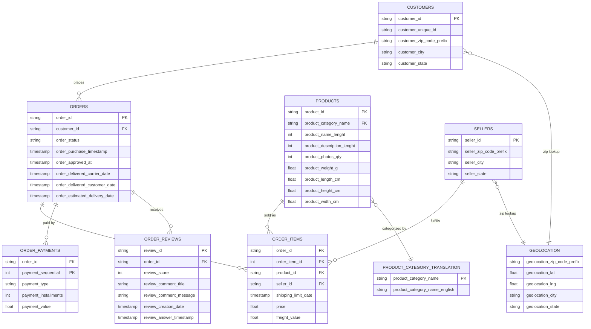
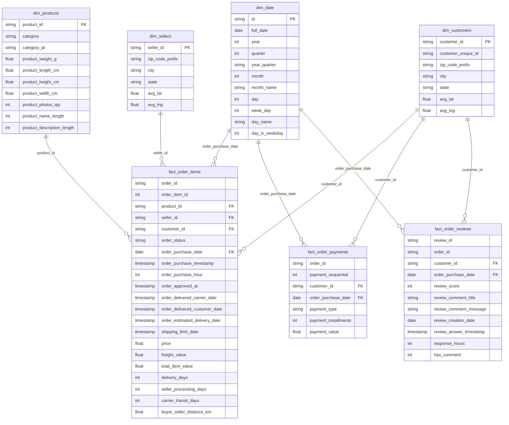

# Mini Project: Data Warehouse & Big Data Analytics — Olist Brazilian E-Commerce

การออกแบบคลังข้อมูล (Data Warehouse) และโมเดลข้อมูลหลายมิติ (Multidimensional Data Model)
เพื่อแปลงระบบ OLTP ของ [Olist Brazilian E-Commerce Public Dataset](https://www.kaggle.com/datasets/olistbr/brazilian-ecommerce)
ให้กลายเป็นระบบ OLAP สำหรับตอบคำถามทางธุรกิจ

---

## 1. Operational Database

Olist เป็นแพลตฟอร์มมาร์เก็ตเพลสของบราซิลที่เชื่อมร้านค้า (sellers) เข้ากับลูกค้าทั่วประเทศ
ชุดข้อมูลนี้เป็นข้อมูลธุรกรรมจริง (anonymized) ระหว่างปี 2016–2018 ประกอบด้วย 9 ตาราง:

| ตาราง | คำอธิบาย | จำนวนแถว (โดยประมาณ) |
|---|---|---|
| `olist_customers_dataset` | ข้อมูลลูกค้าและที่อยู่ (เมือง/รัฐ/zip) | 99,442 |
| `olist_orders_dataset` | หัวออเดอร์ สถานะ และ timestamp แต่ละขั้นตอน | 99,442 |
| `olist_order_items_dataset` | รายการสินค้าในแต่ละออเดอร์ ราคา/ค่าส่ง | 112,651 |
| `olist_order_payments_dataset` | การชำระเงินของแต่ละออเดอร์ | 103,887 |
| `olist_order_reviews_dataset` | คะแนนรีวิวและข้อความจากลูกค้า | 104,720 |
| `olist_products_dataset` | แคตตาล็อกสินค้า หมวดหมู่ ขนาด/น้ำหนัก | 32,952 |
| `olist_sellers_dataset` | ข้อมูลผู้ขายและที่อยู่ | 3,096 |
| `olist_geolocation_dataset` | ตาราง lookup zip code → lat/lng/เมือง/รัฐ | 1,000,164 |
| `product_category_name_translation` | แปลชื่อหมวดหมู่สินค้าจากโปรตุเกส → อังกฤษ | 71 |

### ER Diagram (Operational / OLTP)



---

## 2. Business Questions (15 ข้อ)

คัดและรวมจากคำถามธุรกิจ 2 ชุดที่ทีมช่วยกันคิด (ตัดข้อซ้ำและข้อที่ dataset ตอบไม่ได้จริงออก) จัดกลุ่มเป็น 5 ด้านทางธุรกิจ
ทุกข้อตอบได้จริงจากตาราง `dim_*`/`fact_*` ที่ออกแบบไว้ในหัวข้อ 3

**การเติบโตและยอดขาย (Sales & Revenue Growth)**

1. หมวดหมู่สินค้าใดขายดีที่สุด ทั้งในแง่จำนวนชิ้นที่ขายและรายได้รวม — ผลลัพธ์ตรงกันหรือคนละหมวดหมู่กัน?
2. ช่วงวันและเวลาใดที่มียอดสั่งซื้อสูงสุด และแนวโน้มรายได้รวมรายเดือน (MoM Growth) ของแพลตฟอร์มเติบโตขึ้นหรือลดลงอย่างไร?
3. วิธีการชำระเงินแบบใดถูกใช้งานมากที่สุด และแบบใดดันค่าเฉลี่ยต่อคำสั่งซื้อ (AOV) สูงที่สุด?

**พฤติกรรมและกลุ่มลูกค้า (Customer Behavior & Segmentation)**

4. สัดส่วนลูกค้าที่กลับมาซื้อซ้ำ (Repeat Customers) มีกี่ % และถ้านำมาทำ RFM Analysis กลุ่มลูกค้าระดับ Top ทำรายได้ให้แพลตฟอร์มมากขนาดไหน?
5. ลูกค้าที่ซื้อบ่อย (frequent) มีค่าใช้จ่ายเฉลี่ยต่อครั้งต่างจากลูกค้าทั่วไปเท่าไร?
6. ลูกค้าส่วนใหญ่อยู่ในรัฐหรือเมืองไหนกันแน่ และพื้นที่ใดคือ "ตลาดใหม่" ที่มียอดเติบโตของลูกค้าใหม่เร็วที่สุด?

**ประสิทธิภาพการจัดส่ง (Logistics & Delivery Operations)**

7. ระยะเวลาส่งจริงเทียบกับวันที่ระบบคาดการณ์ไว้ (Estimated Date) คลาดเคลื่อนกี่วัน และการส่งช้ากระทบต่อคะแนนรีวิวมากแค่ไหน?
8. ค่าจัดส่ง (Freight Value) คิดเป็นสัดส่วนกี่ % ของราคาสินค้า และหมวดหมู่ใดมีค่าจัดส่งสูงจนกระทบยอดขาย?
9. ปัญหาจัดส่งล่าช้า (Late Delivery) กระจุกตัวอยู่ในเส้นทางระหว่างรัฐใดมากที่สุด และเกิดจากฝั่งร้านค้า (เตรียมสินค้าช้า) หรือฝั่งขนส่ง (ระหว่างทางช้า)?
10. ระยะทางระหว่างตำแหน่งผู้ขายและผู้ซื้อส่งผลต่อคะแนนรีวิวของลูกค้าหรือไม่?

**สินค้าและการทำโปรโมชัน (Product Performance & Marketing)**

11. หมวดหมู่สินค้าใดทำรายได้สูงสุด เทียบกับหมวดหมู่ที่ได้คะแนนรีวิวเฉลี่ยต่ำที่สุด — และสินค้าที่รีวิวสูงขายดีกว่าจริงหรือไม่?
12. องค์ประกอบหน้าสินค้า เช่น จำนวนรูปภาพ ความยาวชื่อ หรือความยาวคำบรรยาย ส่งผลต่อยอดขายและคะแนนรีวิวหรือไม่?
13. สินค้าชนิดใดที่มักถูกสั่งซื้อร่วมกันบ่อยๆ (Market Basket Analysis) เพื่อนำไปจัดชุดโปรโมชัน Cross-selling?

**การคัดกรองและบริหารผู้ขาย (Seller Operations & Quality Control)**

14. ยอดขายรวมของแพลตฟอร์มกระจุกตัวอยู่กับผู้ขายกลุ่ม Top 10% ตามกฎ Pareto (80/20) หรือไม่?
15. ความเร็วในการเตรียมสินค้าและส่งมอบให้ขนส่ง (Fulfillment Speed) ของผู้ขายส่งผลต่อคะแนนรีวิวร้านค้าอย่างไร และร้านที่รีวิวต่ำมีพฤติกรรมร่วมอะไรบ้าง (ส่งช้า/อัตรายกเลิกสูง)?

> หมายเหตุ: ตัดคำถามเรื่อง "ส่วนลด", "วิธีจัดส่ง (ประเภทขนส่ง)", และ "สินค้าคืน" ออกจากทั้งสองชุด เพราะ Olist dataset
> ไม่มีข้อมูลเหล่านี้อยู่เลย (ไม่มีฟิลด์ discount, ไม่มี carrier/shipping-method, ไม่มีตาราง returns) ตอบไม่ได้จริงแม้จะปรับ query

### คำถามแต่ละข้อใช้ Dimension/Measure ใดตอบ

Query จริงของทุกข้ออยู่ที่ [`olist_dw/analyses/analytical_queries.sql`](olist_dw/analyses/analytical_queries.sql)

| # | Dimension ที่ใช้ | Measure ที่ใช้ |
|---|---|---|
| 1 | `dim_products` | `COUNT(*)` (quantity), `SUM(price)` (revenue) |
| 2 | `dim_date` | `SUM(price)`, `COUNT(order_id)` |
| 3 | *(attribute: payment_type)* | `COUNT(order_id)`, `AVG(payment_value)` |
| 4 | `dim_customers` | `SUM(price)` (monetary), `COUNT(order_id)` (frequency), `MAX(order_purchase_date)` (recency) |
| 5 | `dim_customers` | `COUNT(order_id)`, `AVG(order_value)` |
| 6 | `dim_customers`, `dim_date` | `COUNT(customer_unique_id)` |
| 7 | `dim_date` *(order_estimated/delivered_date)* | `AVG(review_score)` |
| 8 | `dim_products` | `SUM(freight_value)`, `SUM(price)` |
| 9 | `dim_sellers`, `dim_customers` | `AVG(seller_processing_days)`, `AVG(carrier_transit_days)` |
| 10 | `dim_customers`, `dim_sellers` | `AVG(buyer_seller_distance_km)`, `AVG(review_score)` |
| 11 | `dim_products` | `SUM(price)`, `AVG(review_score)` |
| 12 | `dim_products` | `product_photos_qty`, `product_name_length`, `product_description_length`, `AVG(review_score)` |
| 13 | `dim_products` | `COUNT(*)` (co-occurrence ของ order_id) |
| 14 | `dim_sellers` | `SUM(price)` |
| 15 | `dim_sellers` | `AVG(seller_processing_days)`, `AVG(review_score)` |

---

## 3. Multidimensional Data Model Design

โครงสร้างนี้เป็น **Fact Constellation (Galaxy Schema)** — มี Fact 3 ตารางใช้ Dimension ร่วมกัน (conformed dimensions)
เพื่อรองรับคำถามทางธุรกิจทั้ง 15 ข้อข้างต้น

### Dimensions

| Dimension | Level (จากละเอียด → หยาบ) | คำอธิบาย |
|---|---|---|
| `dim_date` | Day → Month → Quarter → Year | สร้างจาก `order_purchase_timestamp`, ใช้แจกแจงตามเวลา |
| `dim_customers` | Customer → City → State | grain = 1 แถวต่อ 1 `customer_id`, เก็บ `customer_unique_id` (สำหรับ repeat/RFM analysis) และพิกัด `avg_lat`/`avg_lng` (สำหรับคำนวณระยะทาง) |
| `dim_sellers` | Seller → City → State | grain = 1 แถวต่อ 1 `seller_id`, มีพิกัด `avg_lat`/`avg_lng` เช่นกัน |
| `dim_products` | Product → Category (English) | grain = 1 แถวต่อ 1 `product_id`, แปลชื่อหมวดหมู่เป็นอังกฤษ พร้อม `product_photos_qty`, `product_name_length`, `product_description_length` สำหรับวิเคราะห์ผลของหน้าสินค้าต่อยอดขาย |

### Fact Tables

| Fact | Grain | Measures |
|---|---|---|
| `fact_order_items` | 1 แถวต่อ 1 รายการสินค้าในออเดอร์ (order_id + order_item_id) | `price`, `freight_value`, `total_item_value`, `delivery_days`, `seller_processing_days`, `carrier_transit_days`, `order_purchase_hour`, `buyer_seller_distance_km` |
| `fact_order_payments` | 1 แถวต่อ 1 การชำระเงิน (order_id + payment_sequential) | `payment_value`, `payment_installments` |
| `fact_order_reviews` | 1 แถวต่อ 1 รีวิว (review_id) | `review_score`, `has_comment`, `response_hours` |

### Measures & ประเภท (Additive / Semi-Additive / Non-Additive)

| Measure | ตาราง | ประเภท | เหตุผล |
|---|---|---|---|
| `price` | fact_order_items | **Additive** | SUM ได้ตรงทุกมิติ (ตามเวลา/สินค้า/ลูกค้า/ผู้ขาย) → รายได้รวม |
| `freight_value` | fact_order_items | **Additive** | SUM ได้ตรงทุกมิติ → ค่าขนส่งรวม |
| `total_item_value` | fact_order_items | **Additive** | = price + freight_value, SUM ได้เหมือนกัน |
| `delivery_days` | fact_order_items | **Non-Additive** | เป็นระยะเวลาต่อ 1 ออเดอร์ SUM ข้ามแถวไม่มีความหมาย ใช้ได้แค่ AVG/MIN/MAX |
| `seller_processing_days` | fact_order_items | **Non-Additive** | เหมือน delivery_days — ใช้ AVG เท่านั้น |
| `carrier_transit_days` | fact_order_items | **Non-Additive** | เหมือน delivery_days — ใช้ AVG เท่านั้น |
| `buyer_seller_distance_km` | fact_order_items | **Non-Additive** | ระยะทางต่อ 1 รายการ SUM ไม่มีความหมาย ใช้ AVG |
| `order_purchase_hour` | fact_order_items | **Non-Additive** | เป็นค่าหมวดหมู่เชิงเวลา (0-23) ใช้ GROUP BY ไม่ใช่ SUM |
| `payment_value` | fact_order_payments | **Additive** | SUM ได้ทุกมิติ → ยอดชำระรวม |
| `payment_installments` | fact_order_payments | **Non-Additive** | จำนวนงวด SUM ข้ามออเดอร์ไม่มีความหมาย ใช้ AVG |
| `review_score` | fact_order_reviews | **Non-Additive** | เป็น ordinal scale (1-5) SUM ไม่มีความหมาย ใช้ AVG เท่านั้น |
| `has_comment` | fact_order_reviews | **Semi-Additive** | เป็น flag (0/1) SUM ข้ามมิติอื่นได้ (นับจำนวนรีวิวที่มีคอมเมนต์) แต่ SUM ข้ามมิติเวลาแบบสะสมยังต้องระวังเรื่อง double count ถ้า join ผิด grain |
| `response_hours` | fact_order_reviews | **Non-Additive** | ระยะเวลาต่อ 1 รีวิว ใช้ AVG เท่านั้น |

### Data Model Diagram (Star Schema)



---

## 4. ETL / ELT Process

ใช้แนวทาง **ELT** ผ่าน [dbt](https://www.getdbt.com/) + [DuckDB](https://duckdb.org/):

1. **Extract**: ไฟล์ CSV ทั้ง 9 ไฟล์จาก Kaggle ถูกวางไว้ที่ `olist_dw/datasets/`
2. **Load**: dbt-duckdb ประกาศแต่ละไฟล์เป็น `source` (ผ่าน `external_location` meta ใน `src_olist.yml`)
   ทำให้ DuckDB อ่านข้อมูลดิบเข้ามาได้โดยตรงโดยไม่ต้องเขียนสคริปต์โหลดแยก
3. **Transform (Staging layer)**: โมเดล `stg_*.sql` ดึงข้อมูลจาก source แบบ 1:1 พร้อมเติมคอลัมน์
   `ingestion_timestamp` เพื่อบันทึกเวลาที่โหลดข้อมูล — materialize เป็น `table`
4. **Transform (Data Warehouse layer)**: โมเดลใน `models/datawarehouse/`
   - สร้าง `dim_*` โดย deduplicate ด้วย `ROW_NUMBER()` และ enrich ข้อมูล (เช่น join `geolocation`
     เพื่อหา lat/lng เฉลี่ยของแต่ละ zip code, join `product_category_name_translation`
     เพื่อแปลชื่อหมวดหมู่)
   - สร้าง `fact_*` โดย join กับ `stg_orders` เพื่อดึง `customer_id`/วันที่ แล้วคำนวณ measure
     เช่น `total_item_value`, `delivery_days`
   - ทดสอบคุณภาพข้อมูลด้วย `dbt test` (unique/not_null บน primary key ของแต่ละตาราง)
5. **Serve**: ผลลัพธ์เก็บใน `olist_dw/dev.duckdb` เปิดดูผ่าน `app.py` (table browser)
   และวิเคราะห์ผ่าน `dashboard_app.py` (OLAP dashboard)

---

## 5. Data Warehouse Database

ไฟล์ผลลัพธ์: `olist_dw/dev.duckdb` (สร้างจากการรัน `dbt run` ภายในโฟลเดอร์ `olist_dw/`)
ประกอบด้วย 9 staging tables + 4 dimension tables + 3 fact tables รวม 16 ตาราง

---

## 6. Interactive Dashboard

`dashboard_app.py` (Streamlit + Altair) วิเคราะห์ยอดขายจาก `fact_order_items` join กับ
`dim_date`, `dim_customers`, `dim_products`, `dim_sellers` เท่านั้น ตามที่โจทย์กำหนด
รองรับการกรองตามช่วงวันที่ หมวดหมู่สินค้า รัฐลูกค้า รัฐผู้ขาย และสถานะออเดอร์
พร้อมมุมมองยอดขายตามเวลา (ปี/ไตรมาส/เดือน), ตาม product category, และตาม customer state

🔗 **Live**: https://miniproject-vvcre79hljddpvyj82zuub.streamlit.app

---

## 7. การตั้งค่าและรันโปรเจกต์

```bash
python -m venv .venv
.venv\Scripts\activate
pip freeze > requirements.txt

cd olist_dw
dbt debug
dbt run
dbt test
cd ..

python query_duckdb.py
streamlit run app.py
streamlit run dashboard_app.py
```
---
## 8. Team Contribution

| การ์ด | รายละเอียด | Assignee |
|---|---|---|
| เลือก Operational Database + ER Diagram | เลือก Olist dataset, วาด ER diagram OLTP | chawanakorn-phet, kunthida-samakhan |
| กำหนด Business Questions 15 ข้อ | ระบุคำถามธุรกิจที่ตอบได้จาก dataset | worawatpr-gh, kunthida-samakhan |
| ออกแบบ Dimensional Model | กำหนด Dimension/Level และ Fact/Measure | chawanakorn-phet |
| สร้าง Data Model Diagram (Fact Constellation) | mermaid erDiagram ใน README | chawanakorn-phet, kunthida-samakhan |
| เขียน ETL/ELT Pipeline (dbt + DuckDB) | staging + datawarehouse models, dbt run/test | chawanakorn-phet |
| พัฒนา Interactive Dashboard | Streamlit dashboard จาก fact/dim tables | chawanakorn-phet |
| Deploy Web Application | ขึ้น Streamlit Community Cloud | chawanakorn-phet |
| ทำไฟล์ Infographic | สรุปภาพรวม dashboard/insight | chawanakorn-phet |
| ทำไฟล์&นำเสนอ Presentation | จัดทำสไลด์นำเสนอและนำเสนอหน้าชั้นเรียน | kunthida-samakhan, yiampopbaipo, worawatpr-gh |
| เขียน README สรุปทั้งหมด | รวม ER diagram, business Q, ETL, diagram, ลิงก์ | chawanakorn-phet |

---

## 9. Deliverables

- **Infographic**: https://chawanakorn-phet.github.io/Mini_project/deliverables/infographic.html ([source](deliverables/infographic.html)) — สรุปยอดขาย, top categories/states, ผลกระทบของการจัดส่งล่าช้าต่อคะแนนรีวิว, อัตราลูกค้าซื้อซ้ำ (ตัวเลขทั้งหมดคำนวณจริงจาก `dev.duckdb`)
- **Presentation**: https://canva.link/7srzw8z3nr335cp — สไลด์นำเสนอ
- **ลิงก์ Web Application**: https://miniproject-vvcre79hljddpvyj82zuub.streamlit.app
